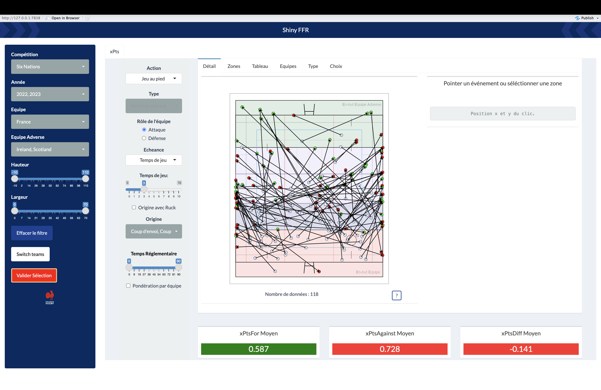
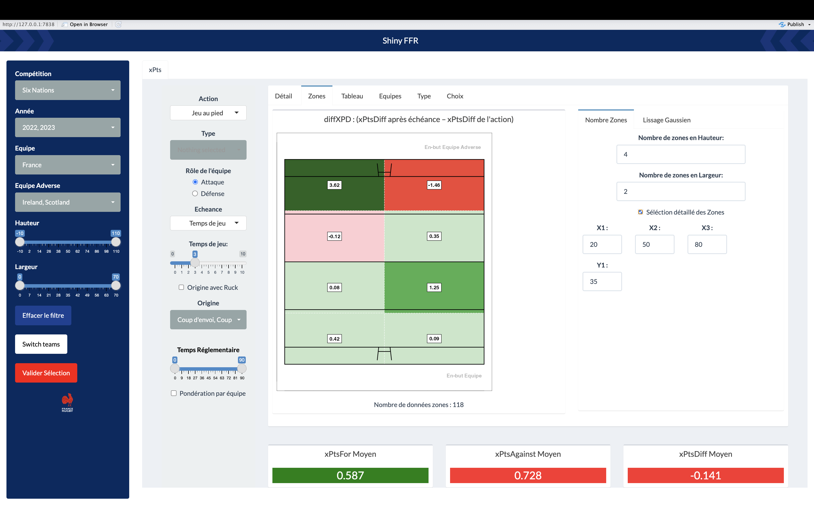
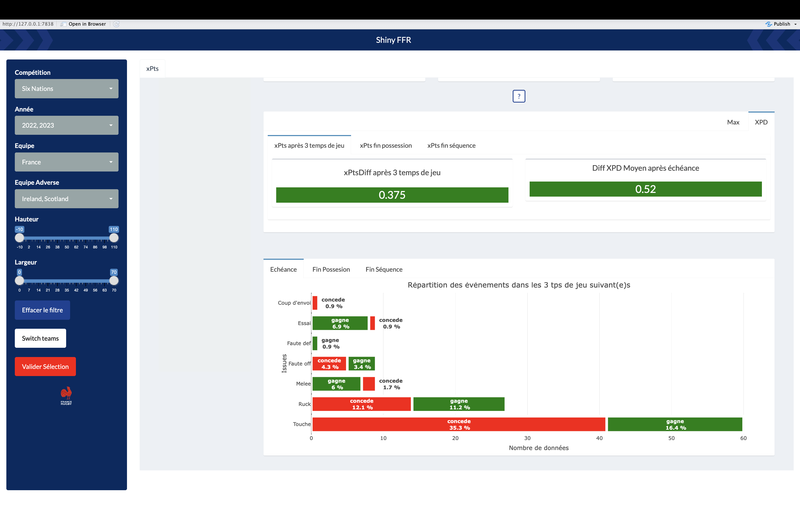

# Shiny-FFR

## Outil d'aide à la décision sur des données évenements

### Description

Cette application a été développée par M. Pisseloup, A. Bremond et T.Sinapi. Elle a été conçue pour la Fédération Française de Rugby dans le but de simplifier le traitement des données et l'accès aux données xPts pour les Sport-Scientists.

### Fonctionnalités

### Auteurs

#### Manon Pisseloup

#### Abel Bremond

#### Thomas Sinapi
